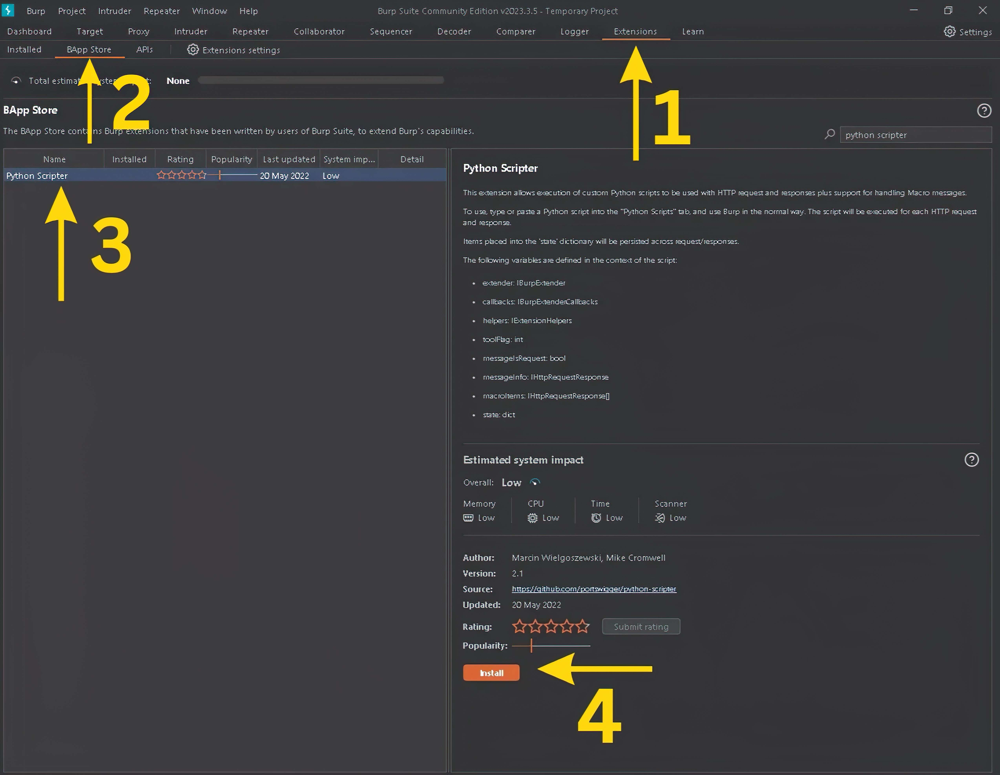
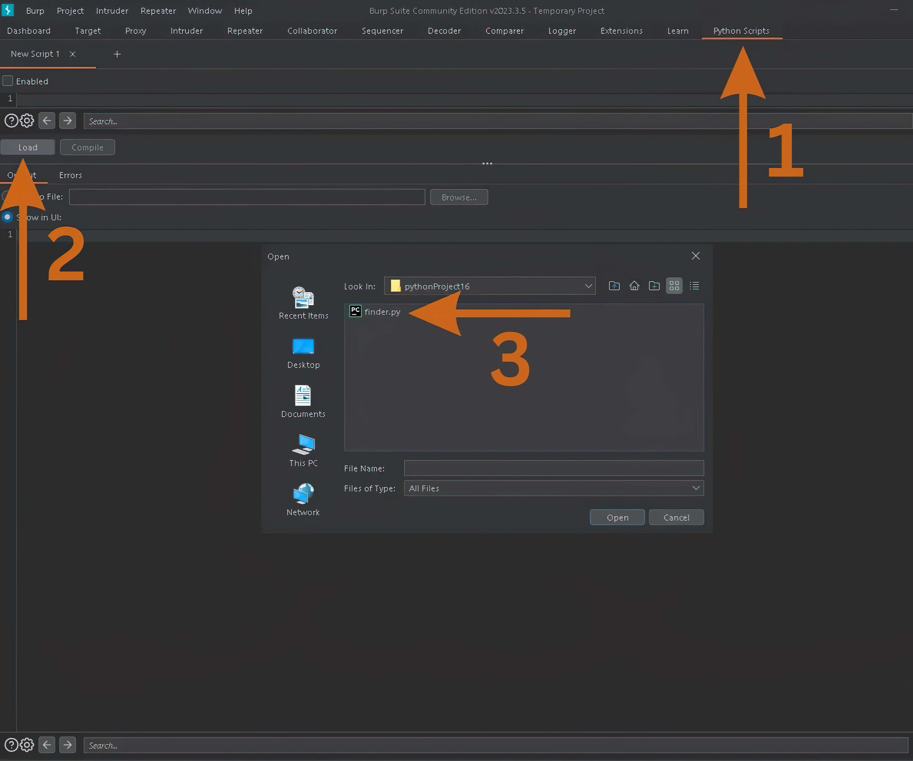
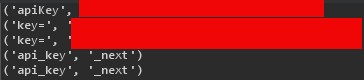

# Python_Finder
It Is a tool designed to catch all sensitive data from response 


# How to install 
```
1- open Burpsuite

2- follow the pictures
```


```
3- git clone https://github.com/N0LL101/python_finder.git
```



## Demo


